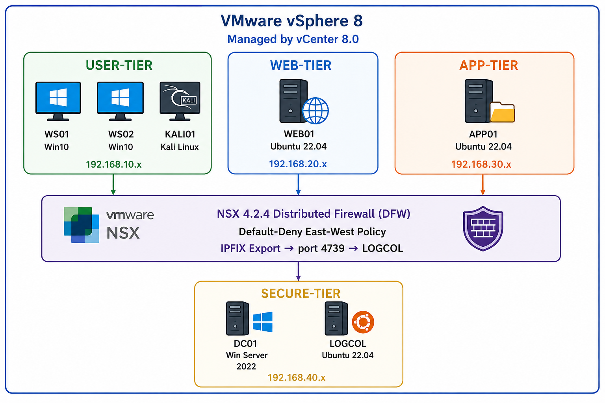

# Detecting Lateral Movement in Virtualized Enterprise Networks Using LSTM-Based Analysis of VMware NSX 4 East-West Traffic Flows
## Overview

This project presents a **machine learning-based lateral movement detection system** built on **VMware NSX 4 Distributed Firewall (DFW) East-West traffic telemetry** evaluated using **Bidirectional LSTM** and **Random Forest** models in a controlled virtualized enterprise lab.

The work demonstrates how **hypervisor-level flow telemetry from NSX 4** — including security group membership, DFW rule match identifiers, and cross-segment flow ratios — provides a richer and more tamper-resistant detection surface than conventional endpoint or perimeter-based approaches. 

The project is implemented on a **real VMware NSX 4.2.4 / vSphere 8 / vCenter 8 lab**, validated through **five controlled lateral movement attack scenarios**, and produces a **self-generated, labelled IPFIX dataset** unavailable in any public benchmark, making it suitable for both **MSc Cybersecurity evaluation and enterprise security research reference**.

## Problem Statement

Modern enterprise networks rely heavily on virtualized infrastructure where workloads communicate through East-West (VM-to-VM) traffic paths that are **invisible to perimeter-based security controls**.

After achieving an initial foothold, adversaries execute lateral movement — traversing internal segments to access domain controllers, databases, and sensitive file stores. The **2026 Verizon DBIR** links lateral movement to the majority of enterprise data breaches, yet most detection tools rely on signature-based alerting that fails against low-and-slow or novel movement patterns.

**This project addresses the question:**

*Can a Bidirectional LSTM model, trained on sequential NSX 4 East-West flow telemetry in a controlled virtualised lab, effectively detect lateral movement techniques — including Pass-the-Hash, RDP pivoting, SMB-based propagation, LDAP enumeration, and WMI remote execution — and how does its detection performance compare against a Random Forest baseline?*

## Project Objectives

- Capture **East-West VM-to-VM traffic** at the hypervisor level using VMware NSX 4 DFW and IPFIX export
- Generate a **self-labelled dataset** of 142,001 flow records across five lateral movement technique categories
- Engineer **five domain-specific features** from NSX IPFIX telemetry not available in any public dataset
- Train and evaluate a **Bidirectional LSTM** (primary) and **Random Forest** (baseline) with SHAP explainability
- Compare detection performance across **six evaluation metrics** including F1, AUC-ROC, AUC-PR, and False Positive Rate
- Provide a fully reproducible **open-source pipeline** from IPFIX collection through to model evaluation

## Lab Architecture

**Lab architecture overview**.

In this lab we are using two host, each host hase 80GB of RAM, 20 CPU core and 1TB of HDD. 

  

*The Image generate by using AI*