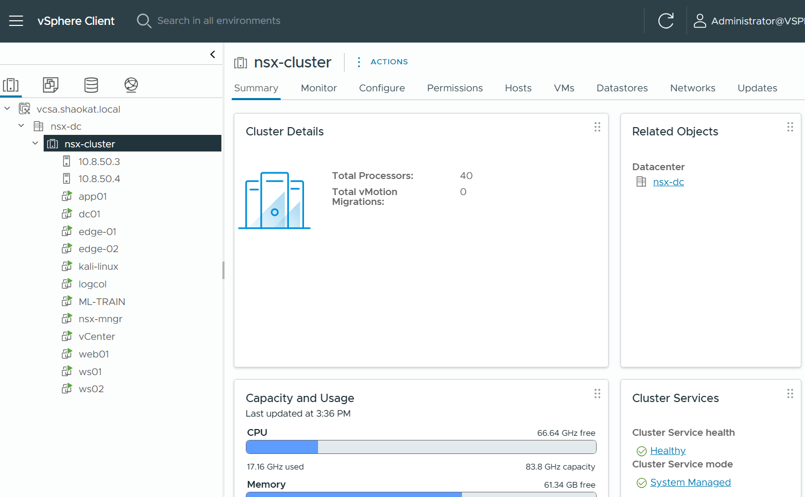

# Detecting Lateral Movement in Virtualized Enterprise Networks Using LSTM-Based Analysis of VMware NSX 4 East-West Traffic Flows
## Overview

This project presents a **machine learning-based lateral movement detection system** built on **VMware NSX 4 Distributed Firewall (DFW) East-West traffic telemetry** evaluated using **Bidirectional LSTM** and **Random Forest** models in a controlled virtualized enterprise lab.

The work demonstrates how **hypervisor-level flow telemetry from NSX 4** — including security group membership, DFW rule match identifiers, and cross-segment flow ratios — provides a richer and more tamper-resistant detection surface than conventional endpoint or perimeter-based approaches. 

The project is implemented on a **real VMware NSX 4.2.4 / vSphere 8 / vCenter 8 lab**, validated through **five controlled lateral movement attack scenarios**, and produces a **self-generated, labelled IPFIX dataset** unavailable in any public benchmark, making it suitable for both **MSc Cybersecurity evaluation and enterprise security research reference**.

## Problem Statement

Modern enterprise networks rely heavily on virtualized infrastructure where workloads communicate through East-West (VM-to-VM) traffic paths that are **invisible to perimeter-based security controls**.

After achieving an initial foothold, adversaries execute lateral movement — traversing internal segments to access domain controllers, databases, and sensitive file stores. The **2026 Verizon DBIR** links lateral movement to the majority of enterprise data breaches, yet most detection tools rely on signature-based alerting that fails against low-and-slow or novel movement patterns.

**This project addresses the question:**

*Can a Bidirectional LSTM model, trained on sequential NSX 4 East-West flow telemetry in a controlled virtualised lab, effectively detect lateral movement techniques — including Pass-the-Hash, RDP pivoting, SMB-based propagation, LDAP enumeration, and WMI remote execution — and how does its detection performance compare against a Random Forest baseline?*

## Project Objectives

- Capture **East-West VM-to-VM traffic** at the hypervisor level using VMware NSX 4 DFW and IPFIX export
- Generate a **self-labelled dataset** of 142,001 flow records across five lateral movement technique categories
- Engineer **five domain-specific features** from NSX IPFIX telemetry not available in any public dataset
- Train and evaluate a **Bidirectional LSTM** (primary) and **Random Forest** (baseline) with SHAP explainability
- Compare detection performance across **six evaluation metrics** including F1, AUC-ROC, AUC-PR, and False Positive Rate
- Provide a fully reproducible **open-source pipeline** from IPFIX collection through to model evaluation

## Lab Architecture

**Lab architecture overview**.

In this lab we are using two host, each host has 80GB of RAM, 20 CPU core and 1TB of HDD. 

Host OS in VMware ESXi 8.0.3, vCenter version is 8.0.3 and NSX version is 4.2.4

  

*The Image generate by using AI*

**Lab overview**

  

## Security Zones
- **MGMT** – vCenter, NSX Manager, jump host, logcol
- **Secure-TIER** – DNS
- **APP-TIER** – File Server
- **WEB-TIER** – Web Application
- **USER-ZONE** – WS01, WS02, Kali Linux

## VM Specifications

| VM Name | OS | vCPU | RAM | Role / NSX Security Group |
|---|---|---:|---:|---|
| DC01 | Windows Server 2022 | 2 | 4 GB | Active Directory Domain Controller — SECURE-TIER |
| WEB01 | Ubuntu 22.04 LTS | 2 | 4 GB | Apache/Nginx web server — WEB-TIER |
| APP01 | Windows Server 2022 | 2 | 4 GB | File server (Samba) + application server — APP-TIER |
| WS01 | Windows 10 Pro | 2 | 4 GB | Employee workstation 1 — USER-TIER |
| WS02 | Windows 10 Pro | 2 | 4 GB | Employee workstation 2 — USER-TIER |
| KALI01 | Kali Linux 2024.x | 2 | 4 GB | Security testing VM — USER-TIER |
| ML-TRAIN | Ubuntu 22.04 LTS | 4 | 16 GB | ML Model — MGMT-TIER |
| LOGCOL | Ubuntu 22.04 LTS | 2 | 8 GB | IPFIX log collector and dataset storage — SECURE-TIER |
| VCSA | VMware vCenter Server Appliance | 4 | 16 GB | Management of ESXi and NSX - MGMT-TIER |
| NSX Manager | NSX Manager Appliance | 4 | 16 GB |  NSX Management- MGMT-TIER|

## Phase 1: ESXi and vCenter Setup

We already have ESXi bare-metal. This phase covers verifying it is ready and deploying vCenter.

**1. Verify ESXi Version**
Log into your ESXi host directly via browser (https://YOUR-ESXI-IP) and confirm the version is ESXi 8.0. If it is ESXi 7.x, you will need to upgrade before NSX 4 can be deployed.

*https://YOUR-ESXI-IP  → Login → Help → About*

**2. Deploy vCenter Server Appliance (VCSA)**

vCenter 8 is deployed as an OVA appliance onto  ESXi host. We manage NSX and all VMs through vCenter.

- 1.	Download the VMware vCenter Server Appliance installer ISO from Broadcom support portal
- 2.	Mount the ISO on your Windows 11 machine and run the installer:
  *D:\vcsa-ui-installer\win32\installer.exe*
- 3.	Choose 'Install' → Stage 1: Deploy OVF to ESXi host
    - ESXi host IP: YOUR-ESXI-IP
    - ESXi root credentials
    - vCenter VM name: VCSA
    - Deployment size: Tiny (sufficient for lab with ≤10 hosts)
    - IP assignment: Static — assign a fixed IP on your network (e.g. 10.8.50.5)
- 4.	Stage 2: Configure vCenter SSO
    - SSO domain: vsphere.local
    - SSO admin password: set a strong password — note it down
- 5.	After deployment completes, access vCenter at:

  *https://10.8.50.5  → Login: administrator@vsphere.local*

For Deploy vCenter Server follow this **[Deploy vCenter Server](https://github.com/shaokatullaha/deploy-vcenter-server)**

## Phase 2: Deploy VMware NSX 4
NSX 4 is deployed as a Manager appliance and then prepared on the ESXi host. This is the most technically complex phase

**1 Download NSX 4 OVA**
- Download NSX-T 4.x OVA from Broadcom support portal
- Recommended version: NSX 4.2.x or latest stable

**2 Deploy NSX Manager**
- 1. In vCenter, right-click the ESXi host → Deploy OVF Template
- 2. Select the NSX Manager OVA file
- 3. Configure deployment:
    -	Name: NSX-MGR
    - Deployment size: Small (4 vCPU, 16GB RAM )
    - Network: connect to your management network
    -	IP: assign a static IP (e.g. 10.8.50.6)
    -	Password: set NSX admin password
- 4.	Power on the NSX Manager VM and wait 10–15 minutes for it to boot
- 5.	Access NSX Manager:

*https://10.8.50.6  → Login: admin / YOUR-PASSWORD*

**3 Register NSX with vCenter**
- 1.	In NSX Manager: System → Configuration → vCenter Server
- 2.	Add vCenter:
    - URL: https://10.8.50.5
    - Username: administrator@vsphere.local
    - Password: vCenter SSO password
- 3.	Accept the certificate thumbprint
- 4.	NSX will now see all VMs and hosts managed by vCenter

**4 Prepare ESXi Host for NSX**
- 1.	In NSX Manager: System → Fabric → Hosts
- 2.	Select your ESXi host → Actions → Configure NSX
- 3.	This installs the NSX kernel modules on ESXi (requires host not in maintenance mode)
- 4.	Wait for host status to show 'NSX Configured'

